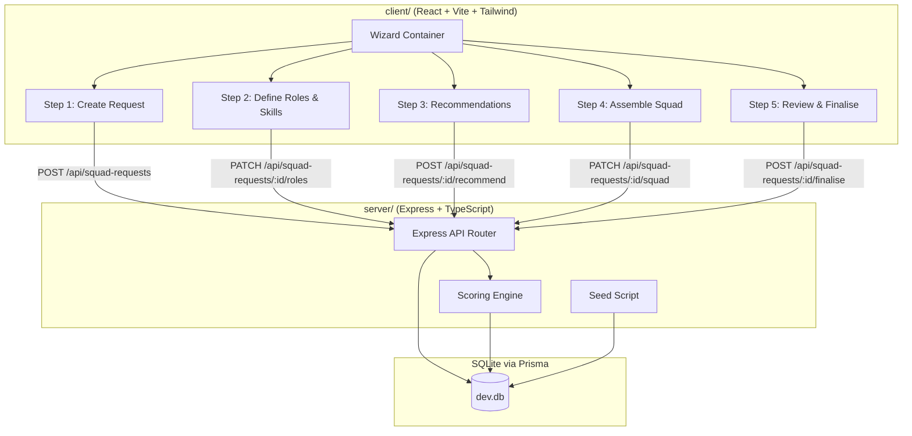
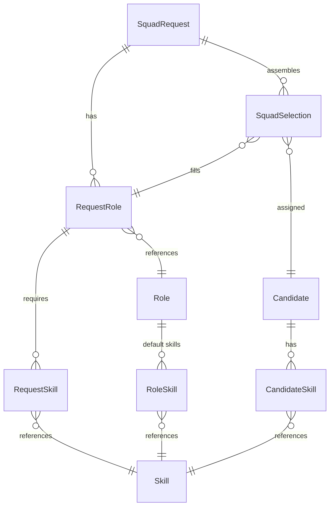

# Design Document: Rapid Squad Assembly

## Overview

Rapid Squad Assembly is a full-stack prototype enabling Delivery Leads to rapidly compose cross-functional delivery squads from a mock internal talent pool. The system follows a linear wizard workflow: create a squad request → define roles/skills → generate scored recommendations → assemble and finalise a proposed squad.

The design prioritises simplicity and demo-readiness over enterprise patterns. All data is mock-seeded into SQLite via Prisma. No authentication, no external integrations, no real PII.

### Key Design Decisions

| Decision | Rationale |
|----------|-----------|
| Single SQLite DB with Prisma | Zero-config, portable, already in the starter |
| Modular scoring engine with rule objects | Meets Requirement 9 — rules can be added/removed/reweighted without touching other code |
| 5-step wizard UI (not SPA routing) | Meets Requirement 8.5 — ≤5 screens, simple state progression |
| Server-side scoring, client-side assembly state | Keeps scoring logic testable and the UI stateless where possible |
| Mock data seed script | Reproducible demo state; re-runnable via `npm run db:seed` |

---

## Architecture

### High-Level Component Diagram



### Request Flow

1. Client renders a wizard. Each step collects data and calls the corresponding API endpoint.
2. Express routes validate input, delegate to service functions.
3. The scoring engine is invoked on the "recommend" step — it queries candidates from the DB, applies configurable rules, and returns ranked shortlists.
4. Assembly state (selected candidates) is managed client-side and persisted via PATCH when the user finalises.

---

## Components and Interfaces

### Backend Components

| Component | Location | Responsibility |
|-----------|----------|----------------|
| `api.ts` routes | `server/src/routes/` | HTTP endpoints, request validation, response shaping |
| `squadRequest.service.ts` | `server/src/services/` | Business logic for squad request CRUD |
| `scoring.service.ts` | `server/src/services/` | Orchestrates scoring engine execution |
| `scoring/engine.ts` | `server/src/scoring/` | Core engine: iterates rules, aggregates scores |
| `scoring/rules/*.ts` | `server/src/scoring/rules/` | Individual rule implementations |
| `scoring/config.ts` | `server/src/scoring/` | Default weights and thresholds |
| `prisma/seed.ts` | `server/prisma/` | Mock data generation |

### Frontend Components

| Component | Location | Responsibility |
|-----------|----------|----------------|
| `SquadWizard` | `client/src/components/SquadWizard.tsx` | Wizard container — manages step state |
| `CreateRequestStep` | `client/src/components/steps/CreateRequestStep.tsx` | Form for request metadata |
| `DefineRolesStep` | `client/src/components/steps/DefineRolesStep.tsx` | Role/skill selection UI |
| `RecommendationsStep` | `client/src/components/steps/RecommendationsStep.tsx` | Displays scored shortlists |
| `AssembleSquadStep` | `client/src/components/steps/AssembleSquadStep.tsx` | Candidate selection with warnings |
| `ReviewFinaliseStep` | `client/src/components/steps/ReviewFinaliseStep.tsx` | Summary and confirm/reset actions |
| `CandidateCard` | `client/src/components/ui/CandidateCard.tsx` | Reusable candidate display |
| `ScoreBadge` | `client/src/components/ui/ScoreBadge.tsx` | Match score visual indicator |
| `AvailabilityBadge` | `client/src/components/ui/AvailabilityBadge.tsx` | Availability colour indicator |
| `GapIndicator` | `client/src/components/ui/GapIndicator.tsx` | Missing role/skill warning |

### API Interface

#### `POST /api/squad-requests`
Creates a new squad request.

**Request Body:**
```json
{
  "title": "string (max 100)",
  "businessUnit": "string",
  "objective": "string (max 500)",
  "urgency": "low | medium | high",
  "startDate": "ISO date string",
  "durationWeeks": "integer 1-52",
  "requiredCapacity": "10 | 20 | ... | 100"
}
```

**Response:** `201 Created` with the created squad request object.

#### `PATCH /api/squad-requests/:id/roles`
Adds/updates roles and skills for a request.

**Request Body:**
```json
{
  "roles": [
    {
      "roleId": "string",
      "skills": [
        { "skillId": "string | null", "name": "string", "category": "mandatory | preferred", "isCustom": false }
      ]
    }
  ]
}
```

**Response:** `200 OK` with updated request including roles.

#### `POST /api/squad-requests/:id/recommend`
Triggers the scoring engine and returns ranked shortlists.

**Response:**
```json
{
  "shortlists": [
    {
      "roleId": "string",
      "roleName": "string",
      "candidates": [
        {
          "candidateId": "string",
          "name": "string",
          "matchScore": 0-100,
          "availability": "available | partially_available | unavailable",
          "workload": "normal | high",
          "matchedSkills": ["string"],
          "explanation": "string",
          "scoreBreakdown": [
            { "rule": "string", "weight": 0.0-1.0, "contribution": 0-100 }
          ]
        }
      ],
      "hasGap": true/false
    }
  ]
}
```

#### `PATCH /api/squad-requests/:id/squad`
Saves the proposed squad selections.

**Request Body:**
```json
{
  "selections": [
    { "roleId": "string", "candidateId": "string" }
  ]
}
```

**Response:** `200 OK` with updated proposed squad.

#### `POST /api/squad-requests/:id/finalise`
Closes the request.

**Response:** `200 OK` with confirmation payload.

#### `GET /api/roles`
Returns all available roles with their predefined skills.

#### `GET /api/candidates`
Returns all candidates in the talent pool (for debug/display).

---

## Data Models

### Prisma Schema (extends existing)

```prisma
// Existing User model remains untouched

model Candidate {
  id             String   @id @default(uuid())
  name           String
  email          String   @unique
  currentRole    String
  businessUnit   String
  capacityFree   Int      // percentage 0-100
  currentWorkload Int     // percentage 0-100
  createdAt      DateTime @default(now())

  skills         CandidateSkill[]
  squadSelections SquadSelection[]
}

model Role {
  id    String @id @default(uuid())
  name  String @unique  // architect, engineer, tester, etc.

  skills      RoleSkill[]
  requestRoles RequestRole[]
}

model Skill {
  id       String @id @default(uuid())
  name     String @unique
  category String // "technical", "domain", "soft", "other"

  roleSkills      RoleSkill[]
  candidateSkills CandidateSkill[]
  requestSkills   RequestSkill[]
}

model RoleSkill {
  id      String @id @default(uuid())
  roleId  String
  skillId String

  role  Role  @relation(fields: [roleId], references: [id])
  skill Skill @relation(fields: [skillId], references: [id])

  @@unique([roleId, skillId])
}

model CandidateSkill {
  id          String @id @default(uuid())
  candidateId String
  skillId     String
  proficiency Int    // 1-5 scale

  candidate Candidate @relation(fields: [candidateId], references: [id])
  skill     Skill     @relation(fields: [skillId], references: [id])

  @@unique([candidateId, skillId])
}

model SquadRequest {
  id               String   @id @default(uuid())
  title            String
  businessUnit     String
  objective        String
  urgency          String   // "low", "medium", "high"
  startDate        DateTime
  durationWeeks    Int
  requiredCapacity Int      // 10-100, increment of 10
  status           String   @default("draft") // "draft", "recommended", "assembled", "finalised"
  createdAt        DateTime @default(now())
  updatedAt        DateTime @updatedAt

  roles      RequestRole[]
  selections SquadSelection[]
}

model RequestRole {
  id             String @id @default(uuid())
  squadRequestId String
  roleId         String

  squadRequest SquadRequest @relation(fields: [squadRequestId], references: [id])
  role         Role         @relation(fields: [roleId], references: [id])
  skills       RequestSkill[]
  selections   SquadSelection[]

  @@unique([squadRequestId, roleId])
}

model RequestSkill {
  id            String @id @default(uuid())
  requestRoleId String
  skillId       String
  priority      String  // "mandatory" or "preferred"
  isCustom      Boolean @default(false)
  customName    String? // only if isCustom = true

  requestRole RequestRole @relation(fields: [requestRoleId], references: [id])
  skill       Skill       @relation(fields: [skillId], references: [id])
}

model SquadSelection {
  id             String @id @default(uuid())
  squadRequestId String
  requestRoleId  String
  candidateId    String
  createdAt      DateTime @default(now())

  squadRequest SquadRequest @relation(fields: [squadRequestId], references: [id])
  requestRole  RequestRole  @relation(fields: [requestRoleId], references: [id])
  candidate    Candidate    @relation(fields: [candidateId], references: [id])

  @@unique([squadRequestId, requestRoleId, candidateId])
}
```

### Entity Relationship Diagram



### Scoring Engine Design

The scoring engine is the core algorithmic component. It follows a pipeline pattern with pluggable rules.


#### Rule Interface

```typescript
interface ScoringRule {
  name: string;
  weight: number; // from config, 0.0–1.0
  evaluate(candidate: CandidateContext, request: RequestContext): RuleResult;
}

interface RuleResult {
  score: number;        // 0–100 raw score for this rule
  explanation: string;  // human-readable reason
  exclude?: boolean;    // if true, candidate is filtered out
  flag?: string;        // e.g. "high_workload"
}

interface ScoringConfig {
  weights: {
    skillMatch: number;    // default 0.45
    availability: number;  // default 0.25
    workload: number;      // default 0.15
    urgency: number;       // default 0.15
  };
  thresholds: {
    workloadHigh: number;  // default 80 (%)
    minMandatorySkills: number; // default 1
  };
}
```

#### Scoring Algorithm

1. **Filter phase**: Remove candidates missing ALL mandatory skills or marked unavailable.
2. **Score phase**: Each rule produces a raw score (0–100). The engine multiplies by the rule's weight.
3. **Aggregate**: `totalScore = Σ(rule.score × rule.weight)`, clamped to 0–100.
4. **Tiebreak**: Equal scores broken by higher availability percentage.
5. **Urgency override**: When urgency=high, available candidates sort above partially_available regardless of score (Requirement 5.7).
6. **Output**: Top 10 per role, with score breakdown and explanation.

#### Individual Rules

| Rule | Logic |
|------|-------|
| **SkillMatchRule** | `score = (mandatoryMatched × 2 + preferredMatched) / (totalMandatory × 2 + totalPreferred) × 100`. Excludes if mandatoryMatched = 0. |
| **AvailabilityRule** | `available` = 100, `partially_available` = 50, `unavailable` = exclude. |
| **WorkloadRule** | `score = max(0, 100 - currentWorkload)`. Flags if workload > threshold. |
| **UrgencyRule** | When urgency=high: available candidates get 100, partially_available get 40. When medium: 80/60. When low: all get 70 (neutral). |

### Mock Data Seeding Strategy

The seed script (`server/prisma/seed.ts`) generates:

| Entity | Count | Strategy |
|--------|-------|----------|
| Roles | 6 | Fixed: architect, engineer, tester, data specialist, business analyst, delivery lead |
| Skills | ~30 | Predefined per role (5 per role avg) |
| Candidates | 30–50 | Faker-generated names, randomised skills (3–8 per candidate), random availability (20–100%), random workload (10–90%) |
| Business Unit | 1 | Fixed: "Digital Platforms" |

Seed is idempotent — uses `upsert` to allow re-running without duplicates. Run via:
```bash
npx prisma db seed
```

Configured in `server/package.json`:
```json
{
  "prisma": {
    "seed": "npx tsx prisma/seed.ts"
  }
}
```

---


## Correctness Properties

*A property is a characteristic or behavior that should hold true across all valid executions of a system — essentially, a formal statement about what the system should do. Properties serve as the bridge between human-readable specifications and machine-verifiable correctness guarantees.*

### Property 1: Squad Request Round-Trip

*For any* valid set of squad request fields (title ≤100 chars, objective ≤500 chars, urgency in {low, medium, high}, durationWeeks 1–52, requiredCapacity in {10,20,...,100}, startDate ≥ today), creating a squad request and then reading it back SHALL produce an object with identical field values.

**Validates: Requirements 1.2**

### Property 2: Validation Identifies All Field Violations

*For any* squad request input where one or more mandatory fields are missing, empty, or outside their valid range, the validation function SHALL reject the input and return an error set that contains exactly the fields that violate constraints — no false positives and no false negatives.

**Validates: Requirements 1.3, 1.4, 1.5**

### Property 3: Availability Indicator Classification

*For any* integer capacity value from 0 to 100, the availability classification function SHALL return `available` for values ≥75, `partially_available` for values 25–74, and `unavailable` for values <25. For null/undefined capacity, it SHALL return `unavailable`.

**Validates: Requirements 4.1, 4.3**

### Property 4: Business Unit Invariant

*For any* scoring engine execution against any squad request, all candidates returned in the shortlist SHALL belong to the same business unit as the squad request.

**Validates: Requirements 2.1, 2.2**

### Property 5: Eligibility Gates Exclude Ineligible Candidates

*For any* candidate who matches zero mandatory skills for a requested role OR has an availability indicator of `unavailable`, the scoring engine SHALL exclude that candidate from the shortlist for that role.

**Validates: Requirements 5.3, 5.4**

### Property 6: Score Bounds and Mandatory Skill Weighting

*For any* candidate evaluated by the scoring engine, the Match_Score SHALL be between 0 and 100 inclusive. Furthermore, for any two candidates identical except that one matches an additional mandatory skill, that candidate SHALL have a higher score than one who matches only an additional preferred skill.

**Validates: Requirements 5.2**

### Property 7: Reduced Ranking for Partial Availability and High Workload

*For any* two candidates identical in skills, where one is `available` and the other is `partially_available`, the available candidate SHALL have a higher availability score contribution. Similarly, for any candidate whose workload exceeds the configured threshold, the workload score contribution SHALL be lower than an otherwise-identical candidate below the threshold, and the high-workload candidate SHALL be flagged.

**Validates: Requirements 5.5, 5.6**

### Property 8: High Urgency Availability Override

*For any* squad request with urgency=high and any two candidates where one has availability=`available` and the other has availability=`partially_available`, the available candidate SHALL rank higher in the shortlist regardless of their relative Match_Scores.

**Validates: Requirements 5.7**

### Property 9: Tiebreak by Availability

*For any* two candidates with identical Match_Scores in the same shortlist, the candidate with higher capacity free (percentage) SHALL rank higher.

**Validates: Requirements 5.8**

### Property 10: Shortlist Size and Ordering

*For any* role in a scoring result, the shortlist SHALL contain at most 10 candidates, and they SHALL be ordered by Match_Score descending (subject to the urgency override in Property 8).

**Validates: Requirements 6.1**

### Property 11: Scoring Output Completeness

*For any* candidate in a scoring result, the output SHALL include: candidate name, role, matchedSkills (array), availability indicator, workload indicator, matchScore (number 0–100), explanation (string), and scoreBreakdown (array of {rule, weight, contribution} for each active rule).

**Validates: Requirements 6.2, 6.3, 9.3**

### Property 12: Explanation Contains Required Elements

*For any* candidate in a scoring result, the explanation string SHALL reference at least one matched skill by name, state the availability status, and name at least one scoring rule that was applied.

**Validates: Requirements 6.4**

### Property 13: Configuration Weights Affect Scoring

*For any* valid scoring configuration with different weight distributions, the scoring engine SHALL produce Match_Scores that reflect the configured weights — specifically, increasing a rule's weight while decreasing another SHALL increase the score contribution of the first rule relative to the second for any candidate where both rules produce non-zero scores.

**Validates: Requirements 9.2**

### Property 14: Failing Rule Resilience

*For any* scoring engine configuration that includes a rule which throws an error during evaluation, the engine SHALL exclude only that rule's contribution from the final score, continue processing all remaining rules, and still produce a valid scored result for the candidate.

**Validates: Requirements 9.4**

### Property 15: Missing Roles Identification

*For any* proposed squad selection that does not include at least one candidate for every mandatory role in the squad request, the system SHALL identify exactly the set of unfilled roles — no false positives and no false negatives.

**Validates: Requirements 7.3**

### Property 16: Custom Skill Description Validation

*For any* string of length outside the range 1–200 characters, the custom skill validation function SHALL reject it. For any string of length 1–200, it SHALL accept it.

**Validates: Requirements 3.4**

---

## Error Handling

### Backend Error Strategy

| Scenario | HTTP Status | Error Code | Behaviour |
|----------|-------------|------------|-----------|
| Missing/invalid request fields | 400 | `VALIDATION_ERROR` | Return array of field-level errors |
| Squad request not found | 404 | `NOT_FOUND` | Return resource identifier in message |
| Invalid state transition (e.g. finalise without full squad) | 409 | `INVALID_STATE` | Return current state and required conditions |
| Scoring rule failure | 200 (partial) | N/A | Log failure, exclude rule, return results with note |
| Unexpected server error | 500 | `INTERNAL_ERROR` | Generic message, log full stack trace |

### Frontend Error Strategy

- **Form validation errors**: Display inline field-level messages using Tailwind's `text-red-500` styling. Preserve all entered data.
- **API errors**: Display a toast/banner at the top of the wizard step. Never navigate away on error.
- **Network failures**: Display "Connection lost — please retry" message. Keep form state intact.
- **Scoring failures**: If a role returns zero candidates, display the `GapIndicator` component rather than an error.

### Scoring Engine Fault Tolerance

Per Requirement 9.4, the scoring engine wraps each rule invocation in a try-catch:

```typescript
for (const rule of activeRules) {
  try {
    const result = rule.evaluate(candidateCtx, requestCtx);
    breakdown.push({ rule: rule.name, weight: rule.weight, contribution: result.score * rule.weight });
  } catch (err) {
    logger.warn(`Rule ${rule.name} failed for candidate ${candidate.id}`, err);
    // Skip this rule — do not add to breakdown
  }
}
```

---

## Testing Strategy

### Unit Tests (Vitest)

Focus areas:
- **Validation functions**: Field-level validators for squad request inputs
- **Availability classification**: The pure function mapping capacity → indicator
- **Individual scoring rules**: Each rule tested in isolation with specific inputs
- **Explanation generator**: Verify output format for representative cases
- **API route handlers**: Mocked Prisma, verify response shapes and status codes

### Property-Based Tests (Vitest + fast-check)

The project will use [fast-check](https://github.com/dubzzz/fast-check) for property-based testing, integrated with Vitest.

**Configuration:**
- Minimum 100 iterations per property test
- Each test tagged with: `Feature: rapid-squad-assembly, Property {N}: {title}`
- Custom arbitraries for: SquadRequest, Candidate, ScoringConfig, Role/Skill sets

**Property test files:**
- `server/tests/properties/validation.property.test.ts` — Properties 1, 2, 16
- `server/tests/properties/availability.property.test.ts` — Property 3
- `server/tests/properties/scoring-engine.property.test.ts` — Properties 4–14
- `server/tests/properties/squad-assembly.property.test.ts` — Property 15

### End-to-End Tests (Playwright)

Focus areas:
- Full wizard flow: create request → define roles → view recommendations → assemble → finalise
- Validation error display and field preservation
- Gap indicator display when no candidates match
- Warning display for partially_available selections

### Test Data Strategy

- Unit/property tests use in-memory data structures (no DB dependency)
- E2E tests run against a test database seeded with known data
- Scoring engine tests use factory functions to generate candidate/request fixtures

---
