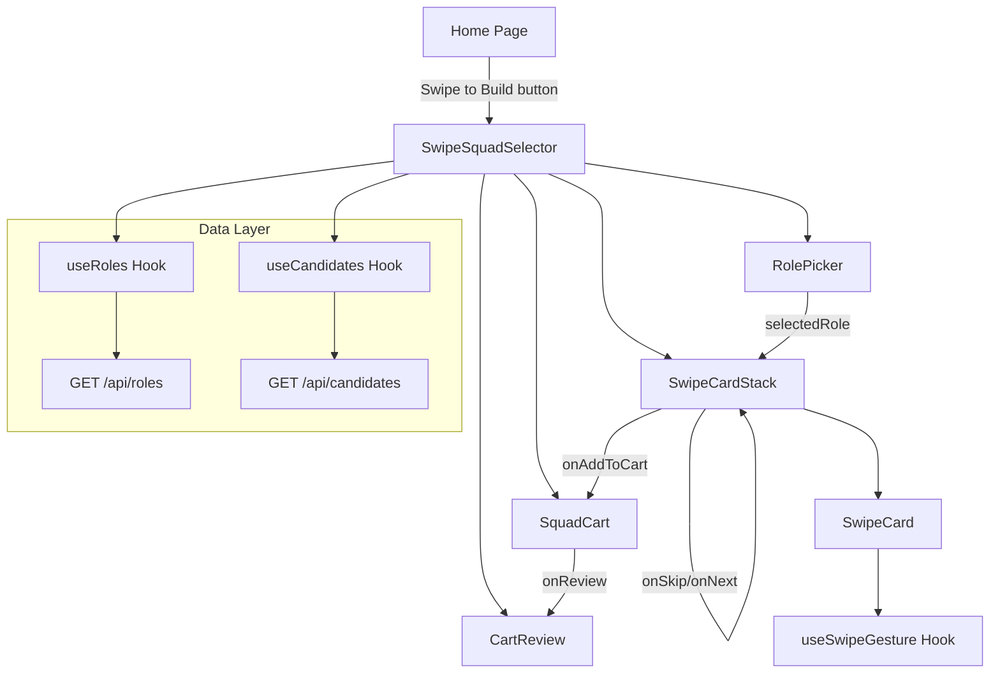
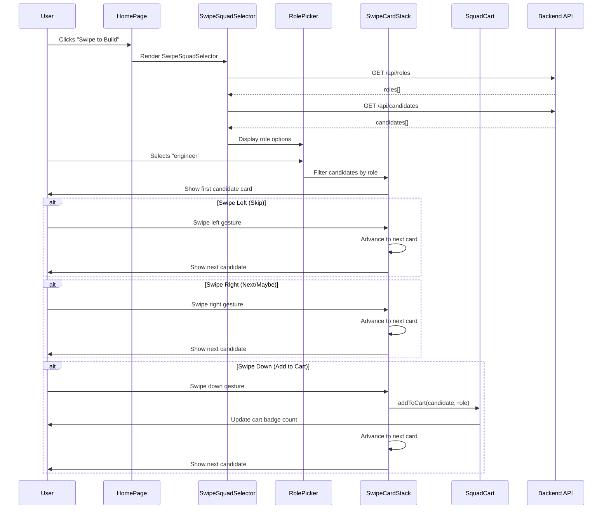
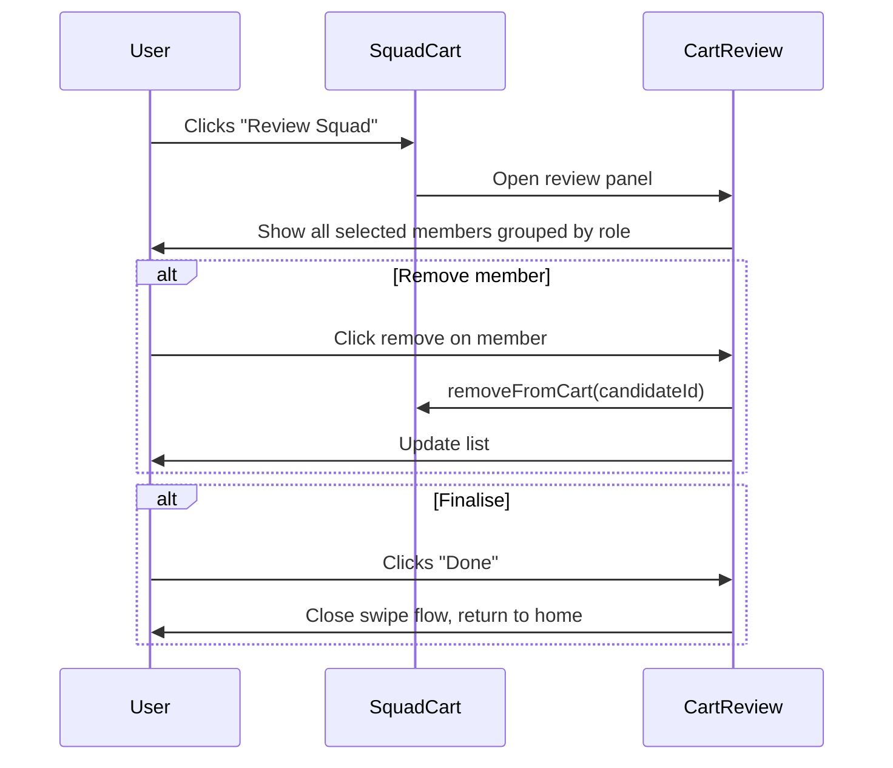

# Design Document: Swipe Squad Selector

## Overview

The Swipe Squad Selector is a Tinder-style card-swiping interface that provides an alternative, tactile method for browsing and selecting team members by role. Unlike the existing 5-step wizard (which requires creating a formal squad request) or the instant search (which returns pre-composed teams), the swipe flow lets a Delivery Lead casually browse individual candidates one at a time, filtering by role, and accumulate selections into a "cart" through an intuitive gesture-based interaction.

The feature is accessed via a dedicated button on the home page, operates independently of the squad request lifecycle, and uses the existing `GET /api/roles` and `GET /api/candidates` endpoints. Swipe left skips a candidate, swipe right moves to the next, and swipe down adds the candidate to the cart. The cart persists across role changes, allowing cross-functional squad assembly.

## Architecture



## Sequence Diagrams

### Main Swipe Flow



### Cart Review Flow



## Components and Interfaces

### Component 1: SwipeSquadSelector (Container)

**Purpose**: Top-level container orchestrating the swipe flow. Manages state for the active role, candidate pool, and cart.

**Interface**:
```typescript
interface SwipeSquadSelectorProps {
  onClose: () => void;
}
```

**Responsibilities**:
- Fetch roles and candidates on mount
- Filter candidates by selected role
- Manage cart state (add/remove members)
- Coordinate transitions between role selection, swiping, and review

### Component 2: RolePicker

**Purpose**: Horizontal role selector allowing the user to pick which role to browse candidates for.

**Interface**:
```typescript
interface RolePickerProps {
  roles: Role[];
  selectedRole: string | null;
  onRoleSelect: (roleId: string) => void;
  cartCountByRole: Record<string, number>;
}
```

**Responsibilities**:
- Display available roles as tappable chips/pills
- Highlight the active role
- Show badge count of cart members per role
- Use role colour coding consistent with existing design system

### Component 3: SwipeCardStack

**Purpose**: Manages the deck of candidate cards and handles swipe gesture detection.

**Interface**:
```typescript
interface SwipeCardStackProps {
  candidates: SwipeCandidate[];
  currentIndex: number;
  onSwipeLeft: () => void;
  onSwipeRight: () => void;
  onSwipeDown: (candidate: SwipeCandidate) => void;
  onDeckEmpty: () => void;
}
```

**Responsibilities**:
- Render the top card with peek of next card behind
- Detect swipe gestures (touch and mouse drag)
- Animate card exit in swipe direction
- Call appropriate callback based on swipe direction
- Show empty state when no more candidates

### Component 4: SwipeCard

**Purpose**: Individual candidate card displayed in the swipe stack.

**Interface**:
```typescript
interface SwipeCardProps {
  candidate: SwipeCandidate;
  style?: React.CSSProperties;
  onSwipeStart?: () => void;
}
```

**Responsibilities**:
- Display candidate name, role, key skills (top 5), availability, years experience, current team
- Show a simple match indicator based on availability and experience
- Render swipe direction hint overlays (skip/next/add icons)
- Apply transform styles for drag animation

### Component 5: SquadCart

**Purpose**: Floating cart indicator showing selected members count with expand/collapse.

**Interface**:
```typescript
interface SquadCartProps {
  items: CartItem[];
  onRemove: (candidateId: string) => void;
  onReview: () => void;
  onClear: () => void;
}
```

**Responsibilities**:
- Show floating badge with cart count
- Expand to show list of selected members
- Allow removing individual members
- Provide "Review Squad" action button

### Component 6: CartReview

**Purpose**: Full-screen review of all selected squad members before finalising.

**Interface**:
```typescript
interface CartReviewProps {
  items: CartItem[];
  roles: Role[];
  onRemove: (candidateId: string) => void;
  onDone: () => void;
  onBack: () => void;
}
```

**Responsibilities**:
- Group selected members by role
- Show detailed candidate info for each selection
- Allow removing members from the review screen
- Show gap indicators for roles with no selections
- Provide "Done" and "Back to Swiping" actions

## Data Models

### SwipeCandidate

```typescript
interface SwipeCandidate {
  id: string;
  name: string;
  email: string;
  currentRole: string;
  businessUnit: string;
  capacityFree: number;          // 0-100
  currentWorkload: number;       // 0-100
  yearsExperience: number;
  currentTeam: string;
  skills: CandidateSkill[];      // top skills with proficiency
  projects: CandidateProject[];  // recent projects
  availability: 'available' | 'partially_available' | 'unavailable';
}

interface CandidateSkill {
  id: string;
  name: string;
  category: string;
  proficiency: 1 | 2 | 3;
}

interface CandidateProject {
  id: string;
  projectName: string;
  rolePlayed: string;
}
```

**Derivation Rules**:
- `availability` is derived from `capacityFree`: ≥75 → "available", 25–74 → "partially_available", <25 → "unavailable"
- Skills limited to top 5 by proficiency for card display
- Candidates with `availability === 'unavailable'` are filtered out of the swipe deck

### CartItem

```typescript
interface CartItem {
  candidateId: string;
  candidateName: string;
  role: string;          // role they were browsed under
  addedAt: number;       // timestamp for ordering
  candidate: SwipeCandidate;  // full candidate data for review
}
```

**Validation Rules**:
- No duplicate candidateId in cart (same person can't be added twice)
- Maximum 20 items in cart (consistent with existing squad limit)
- A candidate can only appear once regardless of which role they were browsed under

### Role

```typescript
interface Role {
  id: string;
  name: string;
  displayName: string;
  colour: string;  // Tailwind colour class
  skills: RoleSkill[];
}

interface RoleSkill {
  id: string;
  skillId: string;
  skill: {
    id: string;
    name: string;
    category: string;
  };
}
```

**Role Colour Mapping**:
| Role | Colour Class |
|------|-------------|
| architect | purple-500 |
| engineer | blue-500 |
| tester | green-500 |
| data specialist | amber-500 |
| business analyst | rose-500 |
| delivery lead | teal-500 |

## Key Functions with Formal Specifications

### Function 1: useSwipeGesture()

```typescript
function useSwipeGesture(
  elementRef: React.RefObject<HTMLElement>,
  callbacks: SwipeCallbacks,
  options?: SwipeOptions
): SwipeState
```

**Preconditions:**
- `elementRef.current` is a valid DOM element when gesture tracking begins
- `callbacks` object contains at least one of: `onSwipeLeft`, `onSwipeRight`, `onSwipeDown`
- Threshold values in `options` are positive numbers

**Postconditions:**
- Returns current `SwipeState` with `direction`, `offset`, and `isDragging`
- Exactly one callback fires per completed swipe gesture
- No callback fires if drag distance is below threshold
- Element returns to original position if swipe is cancelled

**Types:**
```typescript
interface SwipeCallbacks {
  onSwipeLeft?: () => void;
  onSwipeRight?: () => void;
  onSwipeDown?: () => void;
}

interface SwipeOptions {
  threshold: number;        // px distance to trigger swipe (default: 100)
  velocityThreshold: number; // px/ms to trigger quick flick (default: 0.5)
  preventScroll: boolean;    // prevent page scroll during drag (default: true)
}

interface SwipeState {
  offset: { x: number; y: number };
  direction: 'left' | 'right' | 'down' | null;
  isDragging: boolean;
  rotation: number;  // degrees tilt based on horizontal offset
}
```

### Function 2: filterCandidatesByRole()

```typescript
function filterCandidatesByRole(
  candidates: SwipeCandidate[],
  roleId: string,
  excludeIds: Set<string>
): SwipeCandidate[]
```

**Preconditions:**
- `candidates` is a non-empty array of valid SwipeCandidate objects
- `roleId` corresponds to a valid role name
- `excludeIds` is a Set (may be empty)

**Postconditions:**
- Returns only candidates where `candidate.currentRole === roleId`
- No candidate with id in `excludeIds` appears in result
- Candidates with `availability === 'unavailable'` are excluded
- Result preserves original order from input array
- Result is a new array (no mutation of input)

**Loop Invariants:**
- All candidates in the result so far match the role and are not excluded

### Function 3: addToCart()

```typescript
function addToCart(
  cart: CartItem[],
  candidate: SwipeCandidate,
  role: string
): CartItem[]
```

**Preconditions:**
- `cart.length < 20` (cart not full)
- No existing item in `cart` has `candidateId === candidate.id`
- `candidate` is a valid SwipeCandidate
- `role` is a non-empty string

**Postconditions:**
- Returns new array with length `cart.length + 1`
- Last item in result has `candidateId === candidate.id` and `role === role`
- All previous items in cart are unchanged
- If preconditions violated, returns original cart unchanged

### Function 4: removeFromCart()

```typescript
function removeFromCart(
  cart: CartItem[],
  candidateId: string
): CartItem[]
```

**Preconditions:**
- `candidateId` is a non-empty string

**Postconditions:**
- Returns new array without the item matching `candidateId`
- If no item matches, returns array identical to input
- All non-matching items are preserved in original order
- Result length is `cart.length - 1` if item found, else `cart.length`

### Function 5: deriveAvailability()

```typescript
function deriveAvailability(
  capacityFree: number
): 'available' | 'partially_available' | 'unavailable'
```

**Preconditions:**
- `capacityFree` is a number in range [0, 100]

**Postconditions:**
- Returns `'available'` if `capacityFree >= 75`
- Returns `'partially_available'` if `25 <= capacityFree < 75`
- Returns `'unavailable'` if `capacityFree < 25`
- Function is pure (no side effects)

## Algorithmic Pseudocode

### Swipe Gesture Detection Algorithm

```typescript
// Core gesture detection logic within useSwipeGesture hook
function handlePointerUp(state: DragState): SwipeDirection | null {
  const { startX, startY, currentX, currentY, startTime } = state;
  const deltaX = currentX - startX;
  const deltaY = currentY - startY;
  const elapsed = Date.now() - startTime;
  
  const velocityX = Math.abs(deltaX) / elapsed;
  const velocityY = Math.abs(deltaY) / elapsed;
  
  // Priority: vertical (down) takes precedence if both thresholds met
  if (deltaY > THRESHOLD || velocityY > VELOCITY_THRESHOLD) {
    if (deltaY > 0) return 'down';  // only downward counts
  }
  
  // Horizontal swipe
  if (Math.abs(deltaX) > THRESHOLD || velocityX > VELOCITY_THRESHOLD) {
    return deltaX < 0 ? 'left' : 'right';
  }
  
  // Below threshold — cancel (snap back)
  return null;
}
```

**Preconditions:**
- DragState has valid start and current coordinates
- Timestamps are positive integers

**Postconditions:**
- Returns exactly one of 'left', 'right', 'down', or null
- 'down' only returned for positive deltaY (downward motion)
- null indicates the gesture did not meet any threshold

### Card Stack Management Algorithm

```typescript
// Manages which card is active and handles transitions
function advanceCard(
  currentIndex: number,
  deckSize: number,
  direction: 'left' | 'right' | 'down'
): { nextIndex: number; isComplete: boolean } {
  // All directions advance the card
  const nextIndex = currentIndex + 1;
  const isComplete = nextIndex >= deckSize;
  
  return { nextIndex, isComplete };
}
```

**Preconditions:**
- `currentIndex >= 0`
- `deckSize > 0`
- `currentIndex < deckSize`

**Postconditions:**
- `nextIndex === currentIndex + 1`
- `isComplete === true` if and only if `nextIndex >= deckSize`

**Loop Invariants:**
- `0 <= currentIndex < deckSize` while swiping is active

### Candidate Filtering and Sorting Algorithm

```typescript
function prepareDeck(
  allCandidates: SwipeCandidate[],
  selectedRole: string,
  cartIds: Set<string>
): SwipeCandidate[] {
  // Step 1: Filter by role
  const roleMatched = allCandidates.filter(
    c => c.currentRole === selectedRole
  );
  
  // Step 2: Exclude unavailable
  const available = roleMatched.filter(
    c => c.availability !== 'unavailable'
  );
  
  // Step 3: Exclude already in cart
  const notInCart = available.filter(
    c => !cartIds.has(c.id)
  );
  
  // Step 4: Sort by availability (available first) then experience
  const sorted = notInCart.sort((a, b) => {
    const availOrder = { available: 0, partially_available: 1, unavailable: 2 };
    const availDiff = availOrder[a.availability] - availOrder[b.availability];
    if (availDiff !== 0) return availDiff;
    return b.yearsExperience - a.yearsExperience;
  });
  
  return sorted;
}
```

**Preconditions:**
- `allCandidates` is a valid array (may be empty)
- `selectedRole` is a non-empty string matching a known role name
- `cartIds` is a valid Set

**Postconditions:**
- All returned candidates have `currentRole === selectedRole`
- No returned candidate has `availability === 'unavailable'`
- No returned candidate has their id in `cartIds`
- Result is sorted: available candidates first, then by experience descending
- Result is a new array (input not mutated)

## Example Usage

```typescript
// Example 1: Setting up the swipe flow in App.tsx
function App() {
  const [showSwipe, setShowSwipe] = useState(false);

  return (
    <div className="min-h-screen bg-gradient-to-br from-blue-50 to-indigo-100">
      {/* ... existing header and search ... */}
      
      {/* Swipe mode button */}
      <button
        onClick={() => setShowSwipe(true)}
        className="mx-auto flex items-center gap-2 rounded-lg bg-gradient-to-r from-pink-500 to-purple-600 px-6 py-3 text-white font-semibold shadow-lg hover:shadow-xl transition-shadow"
      >
        <SwipeIcon />
        Swipe to Build a Squad
      </button>

      {showSwipe && (
        <SwipeSquadSelector onClose={() => setShowSwipe(false)} />
      )}
    </div>
  );
}

// Example 2: Using the swipe gesture hook
function SwipeCard({ candidate }: SwipeCardProps) {
  const cardRef = useRef<HTMLDivElement>(null);
  const swipeState = useSwipeGesture(cardRef, {
    onSwipeLeft: () => handleSkip(),
    onSwipeRight: () => handleNext(),
    onSwipeDown: () => handleAddToCart(candidate),
  }, { threshold: 100 });

  return (
    <div
      ref={cardRef}
      style={{
        transform: `translateX(${swipeState.offset.x}px) translateY(${swipeState.offset.y}px) rotate(${swipeState.rotation}deg)`,
      }}
      className="absolute inset-0 rounded-xl bg-white shadow-xl p-6 cursor-grab active:cursor-grabbing"
    >
      <h2 className="text-xl font-bold">{candidate.name}</h2>
      <p className="text-sm text-gray-500">{candidate.currentRole}</p>
      {/* ... skills, availability, etc ... */}
    </div>
  );
}

// Example 3: Cart state management
function useSquadCart() {
  const [cart, setCart] = useState<CartItem[]>([]);
  
  const add = useCallback((candidate: SwipeCandidate, role: string) => {
    setCart(prev => addToCart(prev, candidate, role));
  }, []);
  
  const remove = useCallback((candidateId: string) => {
    setCart(prev => removeFromCart(prev, candidateId));
  }, []);
  
  const clear = useCallback(() => setCart([]), []);
  
  const isFull = cart.length >= 20;
  const contains = useCallback(
    (id: string) => cart.some(item => item.candidateId === id),
    [cart]
  );
  
  return { cart, add, remove, clear, isFull, contains };
}

// Example 4: Keyboard accessibility
function SwipeCardStack({ candidates, currentIndex, ...props }: SwipeCardStackProps) {
  const handleKeyDown = (e: React.KeyboardEvent) => {
    switch (e.key) {
      case 'ArrowLeft':
        props.onSwipeLeft();
        break;
      case 'ArrowRight':
        props.onSwipeRight();
        break;
      case 'ArrowDown':
      case 'Enter':
        props.onSwipeDown(candidates[currentIndex]);
        break;
    }
  };

  return (
    <div
      tabIndex={0}
      onKeyDown={handleKeyDown}
      role="application"
      aria-label="Candidate card stack. Use arrow keys to swipe."
      aria-roledescription="swipe deck"
    >
      {/* card rendering */}
    </div>
  );
}
```

## Correctness Properties

*A property is a characteristic or behavior that should hold true across all valid executions of a system — essentially, a formal statement about what the system should do. Properties serve as the bridge between human-readable specifications and machine-verifiable correctness guarantees.*

### Property 1: Cart Uniqueness and Idempotent Add

*For any* cart state and any candidate, the cart never contains duplicate candidateIds. Calling `addToCart` with a candidate already in the cart returns the cart unchanged — `cart.length` remains the same and no duplicate entry is created.

**Validates: Requirements 5.2**

### Property 2: Cart Capacity

*For any* sequence of add operations, `cart.length <= 20` at all times. No operation can cause the cart to exceed 20 members.

**Validates: Requirements 5.1**

### Property 3: Deck Exclusion

*For any* set of candidates and any cart state, all candidates in the visible deck have an id not present in the cart. Candidates already in the cart do not appear in the swipe deck.

**Validates: Requirements 3.3**

### Property 4: Availability Filter

*For any* set of candidates, all candidates in the visible deck have availability not equal to "unavailable". Unavailable candidates are never shown in the swipe deck.

**Validates: Requirements 3.1**

### Property 5: Role Filter

*For any* set of candidates and any selected role `r`, all candidates in the visible deck have `currentRole === r`. Only candidates matching the selected role appear in the deck.

**Validates: Requirements 3.2**

### Property 6: Swipe Determinism

*For any* completed swipe gesture with drag distance above threshold, exactly one of {left, right, down} is determined and exactly one callback fires. No gesture triggers multiple callbacks.

**Validates: Requirements 4.5**

### Property 7: Cart Persistence Across Role Changes

*For any* cart state, changing the selected role does not modify the cart contents. The cart state before and after a role change are identical.

**Validates: Requirements 5.6**

### Property 8: Index Bounds

*For any* valid deck state, `0 <= currentIndex <= deck.length` (equals deck.length only when deck is exhausted). Advancing the index via any swipe direction never produces a negative index or an index beyond deck.length.

**Validates: Requirements 4.1, 4.2**

### Property 9: Order Preservation on Remove

*For any* cart state and any removed candidateId, the relative order of all remaining items is preserved. For items `a`, `b` not removed where `a` appeared before `b` in the original cart, `a` still appears before `b` in the result.

**Validates: Requirements 5.4**

### Property 10: Deck Sorting Invariant

*For any* filtered deck of candidates, all "available" candidates appear before all "partially_available" candidates, and within each availability group candidates are ordered by yearsExperience descending.

**Validates: Requirements 3.4**

### Property 11: Availability Derivation Monotonicity

*For any* two capacityFree values `a` and `b` where `a > b`, deriveAvailability(a) is the same or better availability tier than deriveAvailability(b). Specifically: capacityFree >= 75 yields "available", 25–74 yields "partially_available", and < 25 yields "unavailable".

**Validates: Requirements 9.1, 9.2, 9.3**

### Property 12: Sub-threshold Gesture Cancellation

*For any* drag gesture where the distance is below the configured threshold and velocity is below the velocity threshold, no swipe callback fires and the card returns to its original position (offset resets to {x: 0, y: 0}).

**Validates: Requirements 4.4**

## Error Handling

### Error Scenario 1: API Fetch Failure

**Condition**: `GET /api/roles` or `GET /api/candidates` returns non-2xx or network error
**Response**: Display error banner with retry button; disable role picker and swipe deck
**Recovery**: User clicks retry; re-fetch both endpoints

### Error Scenario 2: Empty Deck for Role

**Condition**: After filtering, no candidates remain for the selected role
**Response**: Display "No candidates available for this role" message with illustration
**Recovery**: User selects a different role or closes the swipe flow

### Error Scenario 3: Cart Full (20 members)

**Condition**: User swipes down when cart already contains 20 members
**Response**: Show toast notification "Cart full — maximum 20 members. Remove someone to add more."
**Recovery**: Swipe gesture is ignored for "add" but left/right still work; user can open cart to remove members

### Error Scenario 4: Touch Conflict with Page Scroll

**Condition**: Vertical scroll gesture conflicts with swipe-down gesture
**Response**: Use a dead zone (first 15px of vertical movement) to disambiguate scroll from swipe
**Recovery**: If within dead zone, allow normal scroll; beyond dead zone, treat as swipe gesture

## Testing Strategy

### Unit Testing Approach

- **Pure functions**: `filterCandidatesByRole`, `addToCart`, `removeFromCart`, `deriveAvailability` — test with various inputs covering boundary cases
- **Gesture detection**: Mock pointer events to test threshold and velocity logic
- **Cart state hook**: Test add/remove/clear/contains operations
- **Component rendering**: Verify SwipeCard renders correct candidate data, RolePicker highlights selection

**Key test cases:**
- Adding duplicate candidate to cart is no-op
- Cart at capacity rejects new additions
- Filtering excludes unavailable candidates
- Role change rebuilds deck without cart modification
- Keyboard navigation fires correct callbacks

### Property-Based Testing Approach

**Property Test Library**: fast-check (already available via vitest ecosystem)

**Properties to test:**
- `addToCart` then `removeFromCart` with same ID returns original cart
- For any sequence of add operations, cart never exceeds 20 items
- `filterCandidatesByRole` output is always a subset of input
- `deriveAvailability` is monotonic (higher capacityFree → same or better availability)
- Swipe gesture detection is deterministic for same input coordinates

### Integration Testing Approach

- **End-to-end flow**: Open swipe mode → select role → swipe through cards → verify cart updates
- **Cross-role persistence**: Add candidates from multiple roles → verify all appear in review
- **Keyboard flow**: Navigate entire flow without mouse
- **Responsive**: Verify layout adapts on mobile viewport

## Performance Considerations

- **Candidate data**: Fetch all candidates once on mount; filter client-side per role. Dataset is capped at 100 candidates (NFR-005), so client-side filtering is performant.
- **Animation**: Use CSS `transform` and `transition` for hardware-accelerated card animations. Avoid layout thrashing.
- **Card rendering**: Only render top 2 cards in DOM (current + peek behind). Remaining candidates exist only in state.
- **Gesture handling**: Use `requestAnimationFrame` for smooth drag tracking. Passive event listeners where possible.
- **Memory**: Cart stores references to candidate objects already in memory — no duplication.

## Security Considerations

- **No new API endpoints**: Feature uses existing `GET /api/roles` and `GET /api/candidates` — no additional attack surface.
- **Client-side only state**: Cart state exists only in React state (no persistence to server or localStorage for this prototype).
- **Input validation**: No user text input required in the swipe flow — only gesture interactions and button clicks.
- **Mock data only**: Consistent with NFR-006, no real PII involved.

## Dependencies

| Dependency | Purpose | Notes |
|-----------|---------|-------|
| React 18 | UI framework | Already installed |
| Tailwind CSS 3 | Styling | Already installed |
| None (custom hook) | Gesture detection | Custom `useSwipeGesture` hook using native Pointer Events API — no external gesture library needed |

**Decision: No external gesture library**
The Pointer Events API provides cross-platform touch/mouse support natively. A custom hook keeps the bundle small and avoids adding a dependency for a single interaction pattern. The gesture logic is straightforward (track drag delta, compare to threshold, fire callback).
