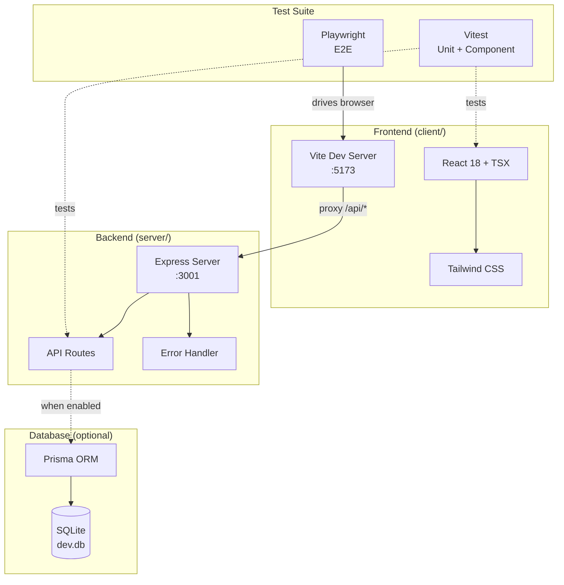
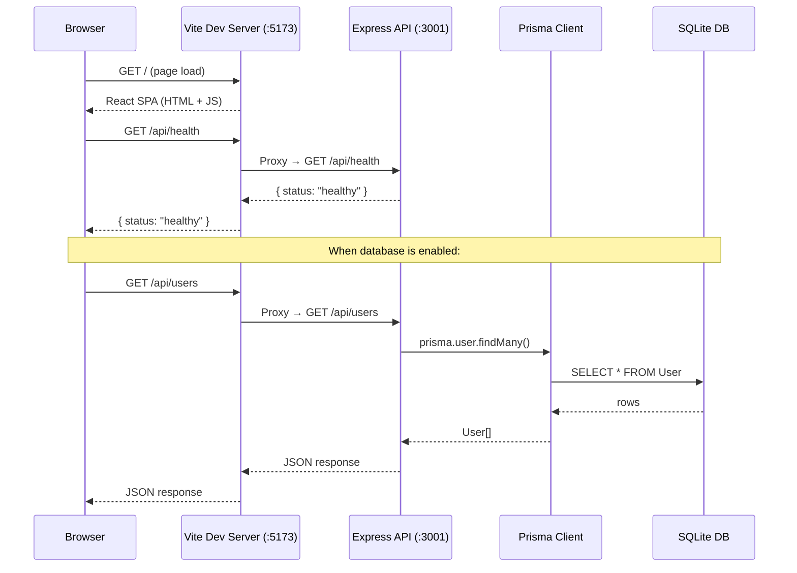
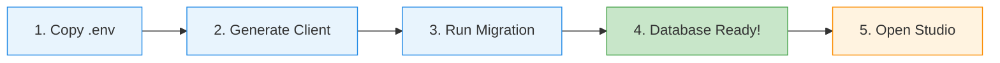
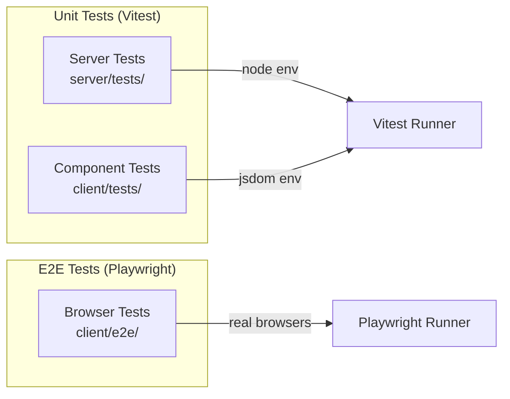

# Node Conf Starter 🚀

A full-stack **Node.js + React** starter template built for the hackathon. Clone it, install, and you're running in two commands — no database or config required to start. Everything is wired together so you can focus on building your feature, not plumbing.

---

## Architecture Overview



---

## Tech Stack at a Glance

| Layer | Technology | Purpose |
|-------|-----------|---------|
| **Runtime** | Node.js 22 LTS | Server-side JavaScript engine |
| **Frontend** | React 18 + Vite | SPA with hot module replacement |
| **Styling** | Tailwind CSS 3 | Utility-first CSS framework |
| **Backend** | Express 4 | HTTP server + REST API |
| **Database** | SQLite + Prisma 5 | Zero-config file-based relational DB with type-safe ORM |
| **Language** | TypeScript 5 (strict) | End-to-end type safety |
| **Unit Tests** | Vitest | Fast, Vite-native test runner |
| **Component Tests** | Testing Library | DOM-based React component tests |
| **E2E Tests** | Playwright | Multi-browser integration tests |
| **Linting** | ESLint 9 (flat config) | Code quality |
| **Formatting** | Prettier | Consistent code style |
| **Monorepo** | npm Workspaces | Single install, shared lockfile |

---

## How the Stack Works Together



### Key Concepts

1. **Vite proxies API calls** — The frontend dev server at `:5173` intercepts any request to `/api/*` and forwards it to Express at `:3001`. This means your frontend code just calls `fetch('/api/...')` — no CORS issues, no hardcoded URLs.

2. **TypeScript everywhere** — Both apps use strict TypeScript. The root `tsconfig.json` defines shared strict settings; each workspace extends it with its own module/target.

3. **ESM throughout** — Both packages use `"type": "module"`. The server uses `NodeNext` module resolution; the client uses Vite's bundler resolution.

4. **Database is opt-in** — The app runs without any database setup. Prisma + SQLite is there when you're ready for persistence.

---

## Prerequisites

- **Node.js 20+** (pinned to **Node 22 LTS** via `.nvmrc`)
- **npm 10+** (ships with Node 20/22)

```bash
# If you use nvm or fnm:
nvm use      # reads .nvmrc → switches to Node 22

# Verify:
node -v      # should say v22.x.x
npm -v       # should say 10.x.x
```

---

## Quick Start

```bash
# 1. Clone the repo
git clone https://github.com/thandog/node-conf-starter.git
cd node-conf-starter

# 2. Install all dependencies (both workspaces)
npm install        # or `npm ci` for a reproducible install from lockfile

# 3. Start both servers in parallel
npm run dev
```

You'll see:

```
[server] 🚀 Server running on http://localhost:3001
[client] VITE v5.x.x ready in Xms
[client] ➜ Local: http://localhost:5173
```

| Service | URL |
|---------|-----|
| Frontend | http://localhost:5173 |
| Backend API | http://localhost:3001 |
| Health Check | http://localhost:3001/health |

> **Why port 3001?** macOS uses port 5000 for AirPlay Receiver. Override with `PORT=XXXX` in `server/.env` if needed.

---

## Project Structure

```
node-conf-starter/
├── package.json            # Workspace root — shared scripts & devDeps
├── tsconfig.json           # Base strict TypeScript config (no emit)
├── eslint.config.mjs       # Flat ESLint config (TS + React + Prettier)
├── .nvmrc                  # Pins Node 22
│
├── server/                 # Express backend
│   ├── package.json        # Server deps (express, prisma, cors, dotenv)
│   ├── tsconfig.json       # Extends root — targets ES2022, NodeNext modules
│   ├── vitest.config.ts    # Vitest config for Node environment
│   ├── .env.example        # Template for local env vars
│   ├── src/
│   │   ├── index.ts        # App entry — creates Express, mounts routes
│   │   ├── routes/
│   │   │   └── api.ts      # /api/* route handlers
│   │   └── middleware/
│   │       └── errorHandler.ts  # Centralized error formatting
│   ├── prisma/
│   │   └── schema.prisma   # Database schema (SQLite, User model)
│   └── tests/
│       └── sample.test.ts  # Example Vitest test
│
├── client/                 # React + Vite frontend
│   ├── package.json        # Client deps (react, vite, tailwind, playwright)
│   ├── tsconfig.json       # Extends root — targets ES2020, bundler resolution
│   ├── vite.config.ts      # Vite config + API proxy setup
│   ├── vitest.config.ts    # Vitest config for jsdom environment
│   ├── tailwind.config.js  # Tailwind configuration
│   ├── playwright.config.ts # E2E test config (multi-browser)
│   ├── index.html          # Vite entry HTML
│   ├── src/
│   │   ├── main.tsx        # React mount point
│   │   ├── App.tsx         # Main app component
│   │   └── index.css       # Tailwind imports
│   ├── tests/
│   │   ├── setup.ts        # Test setup (stubs fetch, adds jest-dom matchers)
│   │   └── App.test.tsx    # Component test example
│   └── e2e/
│       └── sample.spec.ts  # Playwright E2E test example
```

---

## Available Scripts

### Root-level (run from repo root)

| Command | What it does |
|---------|-------------|
| `npm run dev` | Start server + client concurrently (hot reload) |
| `npm run build` | TypeScript compile + production bundle both apps |
| `npm start` | Run the compiled backend from `server/dist/` |
| `npm test` | Run all unit + component tests (both workspaces) |
| `npm run test:e2e` | Run Playwright E2E tests |
| `npm run lint` | Lint everything with ESLint |
| `npm run lint:fix` | Lint and auto-fix |
| `npm run format` | Format all files with Prettier |
| `npm run format:check` | Check formatting without writing |

### Per-workspace

```bash
# Pattern: npm run <script> --workspace=<server|client>
npm run test:watch --workspace=client     # watch mode
npm run test:coverage --workspace=server  # coverage report
npm run preview --workspace=client        # preview production build
```

---

## Database Setup (SQLite + Prisma)

The database is **optional** — the app works fine without it. When you're ready to add persistence:



### Step-by-step

```bash
# 1. Create the env file (sets DATABASE_URL)
cp server/.env.example server/.env

# 2. Generate the Prisma Client (type-safe query builder)
npm run db:generate --workspace=server

# 3. Create the database and apply the schema
npm run db:migrate --workspace=server
# When prompted, give your migration a name like "init"
```

### Verify the Database is Working

```bash
# Option A: Open Prisma Studio (visual database browser)
npm run db:studio --workspace=server
# Opens at http://localhost:5555 — you'll see the User table

# Option B: Check the file exists
ls server/prisma/dev.db
# Should show the SQLite database file

# Option C: Query it directly with sqlite3 (if installed)
sqlite3 server/prisma/dev.db ".tables"
# Should output: User  _prisma_migrations
```

### Prisma Schema

The starter includes a `User` model at `server/prisma/schema.prisma`:

```prisma
datasource db {
  provider = "sqlite"
  url      = env("DATABASE_URL")   // resolves to file:./dev.db
}

model User {
  id        Int      @id @default(autoincrement())
  email     String   @unique
  name      String?
  createdAt DateTime @default(now())
  updatedAt DateTime @updatedAt
}
```

### Using Prisma in Your Code

```typescript
import { PrismaClient } from '@prisma/client';

const prisma = new PrismaClient();

// Create a user
const user = await prisma.user.create({
  data: { email: 'hacker@conf.dev', name: 'Hackathon Hero' },
});

// Fetch all users
const users = await prisma.user.findMany();
```

### Database Commands Reference

| Command | What it does |
|---------|-------------|
| `npm run db:generate --workspace=server` | Regenerate Prisma Client after schema changes |
| `npm run db:migrate --workspace=server` | Create + apply a new migration |
| `npm run db:migrate:deploy --workspace=server` | Apply pending migrations (production) |
| `npm run db:studio --workspace=server` | Open visual database browser at :5555 |

---

## Testing



### Unit + Component Tests

```bash
# Run all tests once (CI-friendly)
npm test

# Watch mode (re-runs on file changes)
npm run test:watch --workspace=client
npm run test:watch --workspace=server

# Coverage report
npm run test:coverage --workspace=server
npm run test:coverage --workspace=client
```

Tests use:
- **Server**: Vitest in Node environment
- **Client**: Vitest in jsdom environment with Testing Library + a fetch stub (no network calls in tests)

### E2E Tests (Playwright)

Playwright runs real browsers against the running app. First-time setup:

```bash
# Install browsers (one-time)
npx playwright install

# Run E2E tests
npm run test:e2e

# Run with interactive UI
npm run test:e2e:ui --workspace=client
```

Playwright auto-starts both the server and client dev servers. Tests run across Chromium, Firefox, and WebKit.

---

## API Endpoints

| Method | Path | Description | Example |
|--------|------|-------------|---------|
| GET | `/health` | Server liveness check | `curl localhost:3001/health` |
| GET | `/api/health` | API health + uptime | `curl localhost:3001/api/health` |
| GET | `/api/info` | API name, version, env | `curl localhost:3001/api/info` |
| POST | `/api/echo` | Echoes JSON body back | `curl -X POST localhost:3001/api/echo -H "Content-Type: application/json" -d '{"hello":"world"}'` |

### Quick API Test

```bash
# Check the server is alive
curl http://localhost:3001/health
# → {"status":"ok","timestamp":"..."}

# Test the echo endpoint
curl -X POST http://localhost:3001/api/echo \
  -H "Content-Type: application/json" \
  -d '{"team": "awesome", "hack": true}'
# → {"echo":{"team":"awesome","hack":true},"receivedAt":"..."}
```

---

## How to Extend

### Add a New API Route

1. Create a new file in `server/src/routes/` (e.g., `todos.ts`)
2. Export a Router and define your endpoints
3. Mount it in `server/src/index.ts`:
   ```typescript
   import { todosRouter } from './routes/todos.js';
   app.use('/api/todos', todosRouter);
   ```

### Add a New Prisma Model

1. Edit `server/prisma/schema.prisma` — add your model
2. Run `npm run db:migrate --workspace=server` — creates the table
3. Run `npm run db:generate --workspace=server` — updates the client types
4. Import `PrismaClient` in your route and query away

### Add a New React Component

1. Create your component in `client/src/`
2. Import and use it in `App.tsx` (or set up routing)
3. Style with Tailwind utility classes
4. Add a test in `client/tests/`

---

## Environment Variables

| Variable | Default | Location | Description |
|----------|---------|----------|-------------|
| `PORT` | `3001` | `server/.env` | Express server port |
| `NODE_ENV` | `development` | `server/.env` | Environment mode |
| `DATABASE_URL` | `file:./dev.db` | `server/.env` | SQLite database path |
| `VITE_API_URL` | `http://localhost:3001` | `client/.env` | API URL (for proxy override) |

---

## Troubleshooting

| Problem | Solution |
|---------|----------|
| `command not found: node` | Install Node.js 20+ or run `nvm use` |
| Port 3001 already in use | Kill the process or set `PORT=3002` in `server/.env` |
| Prisma client not found | Run `npm run db:generate --workspace=server` |
| E2E tests fail on first run | Run `npx playwright install` to download browsers |
| `Cannot find module` in server | Make sure you ran `npm install` at the repo root |
| SQLite file not found | Run the database setup steps above (copy .env → generate → migrate) |

---

## License

MIT

## Contributing

Issues and enhancement requests welcome. Happy hacking! 🎉
